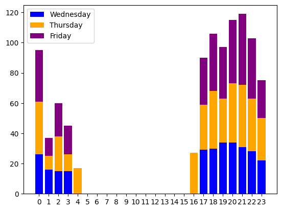
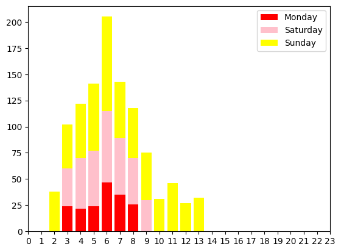
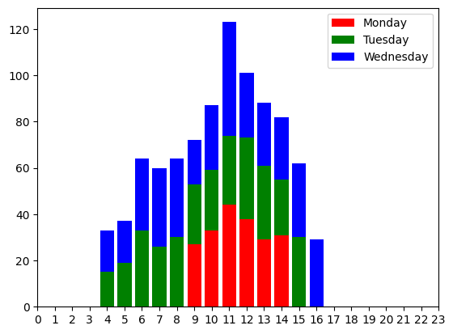
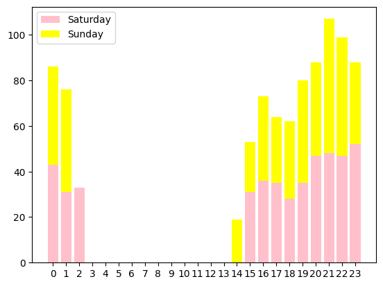
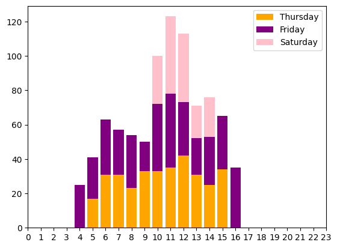
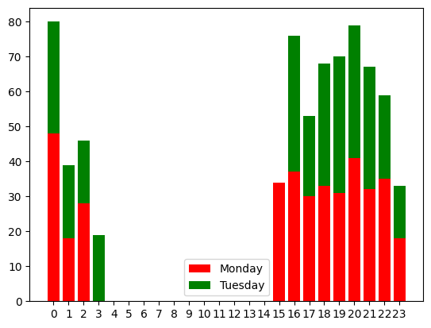

Basado en los clusters obtenidos con **k=6** (silhouette 0.285) para la nueva región, a continuación se presentan acciones concretas de seguridad vial para cada perfil temporal. La numeración de días sigue: **0=Lunes, 1=Martes, 2=Miércoles, 3=Jueves, 4=Viernes, 5=Sábado, 6=Domingo**.

---

### Cluster 0: Noches de miércoles a viernes (principalmente jueves y viernes noche)
**Horas**: 16–23 y madrugada (0–4)  
**Días**: miércoles (2), jueves (3), viernes (4)

- **Perfil**: Accidentes en horas de salida laboral y primeras horas nocturnas de días laborables avanzados. Puede haber consumo de alcohol los jueves y viernes (inicio del fin de semana anticipado).
- **Acciones**:
  - Controles de alcoholemia focalizados los **jueves y viernes de 20 a 23 h** en zonas de bares y restaurantes.
  - Campañas de “Viernes seguro” en empresas: incentivar transporte compartido o designar conductor.
  - Revisar iluminación en avenidas principales utilizadas en ese horario.

---

### Cluster 1: Madrugada y mañana de fin de semana y lunes
**Horas**: 2–13 (principalmente 4–11 h)  
**Días**: sábado (5), domingo (6), lunes (0)

- **Perfil**: Accidentes temprano los fines de semana (posibles viajes de ocio, conducción con resaca) y también el lunes por la mañana (fatiga post‑fin de semana).
- **Acciones**:
  - Controles de alcoholemia **sábados y domingos de 6 a 10 h** en salidas de ciudades y rutas recreativas.
  - Campañas de descanso: “Si saliste de fiesta, no manejes a la mañana”.
  - Lunes por la mañana: controles de velocidad y distracción en accesos a zonas industriales.

---

### Cluster 2: Días laborables centrales (lunes a miércoles, horario diurno)
**Horas**: 5–16 (pico 10–14 h)  
**Días**: lunes (0), martes (1), miércoles (2)

- **Perfil**: Accidentes en horario laboral, mayor densidad de tránsito por desplazamientos al trabajo, entregas, etc.
- **Acciones**:
  - Mejorar sincronización de semáforos en horas pico (8–9 h y 12–14 h).
  - Controles de uso de cinturón de seguridad y distracción (celular) en zonas céntricas.
  - Revisar pasos peatonales y señalización en cercanías de escuelas y oficinas.

---

### Cluster 3: Noches de fin de semana (sábado y domingo noche)
**Horas**: 14–23 y madrugada (0–4 h)  
**Días**: sábado (5), domingo (6)

- **Perfil**: El grupo de **máximo riesgo** por consumo de alcohol, excesos de velocidad y conducción nocturna. Similar al cluster nocturno de fin de semana identificado antes.
- **Acciones prioritarias**:
  - **Controles masivos de alcoholemia** sábados y domingos de 22 a 3 h en accesos a zonas de bares y discotecas.
  - Radares de velocidad en avenidas y rutas que conectan con el ocio nocturno.
  - Promover transporte público nocturno o descuentos en aplicaciones de movilidad.
  - Campañas en redes sociales dirigidas a jóvenes: “Si tomás, no manejes”.

---

### Cluster 4: Días de jueves a sábado (horario diurno y vespertino)
**Horas**: 4–16 (pico 10–15 h)  
**Días**: jueves (3), viernes (4), sábado (5)

- **Perfil**: Accidentes en horas diurnas de final de semana laborable y sábado. Pueden estar relacionados con compras, trámites o desplazamientos de ocio diurno.
- **Acciones**:
  - Controles de documentación y condiciones del vehículo (neumáticos, luces) los viernes y sábados en zonas comerciales.
  - Campañas de seguridad para motociclistas (uso de casco, luces encendidas) en este horario.
  - Mejorar la gestión de estacionamiento en centros comerciales para evitar maniobras peligrosas.

---

### Cluster 5: Noches de lunes y martes
**Horas**: 15–23 y madrugada (0–3 h)  
**Días**: lunes (0), martes (1)

- **Perfil**: Accidentes nocturnos al inicio de la semana laborable. Pueden deberse a fatiga acumulada del fin de semana o salidas esporádicas.
- **Acciones**:
  - Controles de alcoholemia sorpresa los lunes y martes por la noche (menos habituales, pero efectivos para disuadir).
  - Campañas de descanso: “Lunes, volvé con cuidado” enfocadas en conductores que retornan de viajes el domingo noche.
  - Revisar puntos negros con iluminación deficiente en rutas de acceso a la ciudad.

